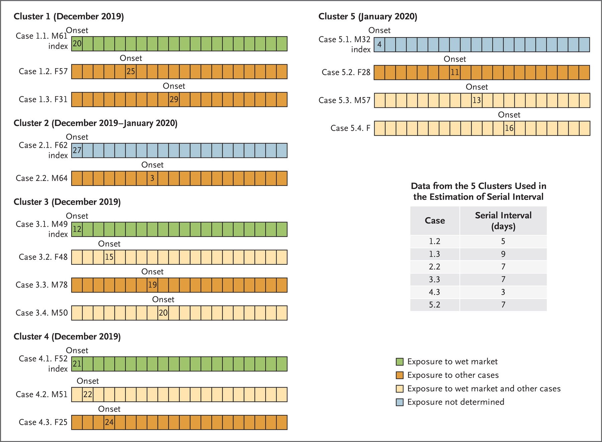

## Using SIR model to analyze outbreak including "ascertainment rates"

So far, we have assumed that the counts of lab-confirmed cases represent all the cases that are infectious. This is unlikely to be true -- typically only a proportion of actual cases are detected or found or sent for testing. This proportion is known as the _ascertainment rate_. The ascertainment rate is likely to change during the course of an outbreak, particularly if surveillance and screening efforts are increased, or if case definitions are changed. Such changing ascertainment rates can be easily incorporated into our model by using a set of weights, or a weighting function, for our incidence data, but for the sake of simplicity, let's see what happens if we assume a fixed ascertainment rate of 20%^[In a very interesting paper, [Nishiura _et al_.](https://doi.org/10.3390/jcm9020419) state: "_There were two interesting features of the evacuation process conducted by Japanese authorities. 

First, all 565 passengers [repatriated to Japan from Wuhan] were screened for symptoms upon arrival. Prior to disembarkation, the quarantine officers used portable thermoscanners to screen the temperature. In the following, all passengers were interviewed regarding whether they have any symptoms suggestive of upper respiratory tract infection, including fever and cough. Of the 565 passengers, 63 were symptomatic. Second, the passengers were tested for presence of 2019‐nCoV using reverse transcription polymerase chain reaction (RT‐PCR), and eight passengers (1.4%) were determined to have the virus. Importantly, most of the individuals positive for the virus were asymptomatic (five passengers), while only the other three had symptoms consistent with 2019‐nCoV infection, indicating that the dataset generated from this process can help investigate the full spectrum of infection including mild and asymptomatic infections._". Thus, they found about 60% of those infected with the COVID-19 virus were essentially asymptomatic, and thus likely to be undetected and unascertained.]. 

If we apply that, thus inflating the number of incident cases by a factor of 5, and refit our model, we get the following results.

```{r SIR_with_ascertianment_rate, tidy=TRUE, echo=FALSE}
# put the daily cumulative incidence numbers for Peru from 
# 6th Mar to now into a vector called Infected
sir_start_date <- "2020-03-07"

Infected <- Peru_Cumulative_Incidence %>%
              filter(province == "Peru_cases_increase",
                     Date >= ymd("2020-03-07"),
                     Date <= ymd(Sys.Date())) %>%
              pull(cumulative_incident_cases)

# Apply a fixed 20% ascertainment rate
Infected <- Infected * 5

# Create an incrementing Day vector the same length as our cases vector
Day <- 1:(length(Infected))

# now specify initial values for S, I and R
init <- c(S = N-Infected[1], I = Infected[1], R = 6811)

RSS <- function(parameters) {
  names(parameters) <- c("beta", "gamma")
  out <- ode(y = init, times = Day, func = SIR, parms = parameters)
  fit <- out[ , 3]
  sum((Infected - fit)^2)
}

## Parameters fixed for new incoming data # c(0.1, 0.3)
Opt <- optim(c(0.35, 0.25), RSS, 
             method = "L-BFGS-B", 
             lower = c(0, 0), upper = c(1, 1)) 
# check for convergence
Opt$message
Opt_par <- setNames(Opt$par, c("beta", "gamma"))
Opt_par
R0 <- setNames(Opt_par["beta"] / Opt_par["gamma"], "R0")
R0
```

Note that these fitted parameters are the same as the ones we got above, without an ascertainment rate adjustment. Let's look at the fitted values.

```{r SIR_model_plot_no_intervention_ascertainment_adjustment, echo=FALSE, tidy=TRUE, message=FALSE, warning=FALSE}
# time in days for predictions
t <- 1:100
# get the fitted values from our SIR model
fitted_cumulative_incidence <- data.frame(ode(y = init, times = t, 
                                              func = SIR, parms = Opt_par))

# add a Date column and join the observed incidence data
fitted_cumulative_incidence <- fitted_cumulative_incidence %>%
  mutate(I = round(I)) %>%
  mutate(Date=ymd(sir_start_date) + days(t-1),
         province="Peru_cases_increase") %>%
  left_join(Peru_Cumulative_Incidence %>% 
              ungroup() %>%
              filter(province=="Peru_cases_increase") %>%
              select(Date, cumulative_incident_cases))

# plot the data

plot_ly(type = "scatter", mode = "lines") %>%
  add_trace(x = ~Date, y = ~S,
            line = list(color = "black"),
            hoverinfo = "text",
            text = ~paste("Date: ", Date, "<br>",
                          "Susceptible: ", round(S), "<br>"),
            showlegend = TRUE,
            name = "Susceptible",
            data = fitted_cumulative_incidence ) %>%
  add_trace(x = ~Date, y = ~cumulative_incident_cases,
            mode = "marker",
            marker = list(color = "blue"),
            hoverinfo = "text",
            text = ~paste("Date: ", Date, "<br>",
                          "Observed: ", cumulative_incident_cases, "<br>"),
            showlegend = TRUE,
            name = "Observed",
            data = fitted_cumulative_incidence ) %>%
  add_trace(x = ~Date, y = ~round(I),
            line = list(color = "red"),
            hoverinfo = "text",
            text = ~paste("Date: ", Date, "<br>",
                          "Infected: ", round(I), "<br>"),
            showlegend = TRUE,
            name = "Infected",
            data = fitted_cumulative_incidence ) %>%
  add_trace(x = ~Date, y = ~round(I*0.02),
            line = list(color = "green"),
            hoverinfo = "text",
            text = ~paste("Date: ", Date, "<br>",
                          "Deaths: ", round(I*0.02), "<br>"),
            showlegend = TRUE,
            name = "Deaths",
            data = fitted_cumulative_incidence ) %>%
  add_trace(x = ~Date, y = ~round(R),
            line = list(color = "orange"),
            hoverinfo = "text",
            text = ~paste("Date: ", Date, "<br>",
                          "Recovered: ", round(R), "<br>"),
            showlegend = TRUE,
            name = "Recovered",
            data = fitted_cumulative_incidence
            ) %>%
  layout(xaxis = list(title = ""),
         yaxis = list(title = "# Persons",
                       tickformat=",d"),
         title="Peru COVID-19 - Fitted vs observed cumulative incidence at 20% ascertainment" )


# i <- fitted_cumulative_incidence %>%
#   ggplot(aes(x=Date)) + geom_line(aes(y=I), colour="red") +
#   geom_line(aes(y=S), colour="black") +
#   geom_line(aes(y=R), colour="green") +
#   geom_point(aes(y=cumulative_incident_cases), colour="blue") +
#   scale_y_continuous(labels = scales::comma) +
#   labs(y="Persons", 
#        title="Peru COVID-19 - Fitted vs observed cumulative incidence at 20% ascertainment",
#        subtitle="(red = Infectious, black = Susceptible, green = Recovered, blue = Observed incidence") +
#   scale_colour_manual(name = '', 
#                       values =c('red'='red', 'black'='black', 'green'='green', 'blue'='blue'), 
#                       labels = c('Susceptible', 'Recovered', 'Observed incidence', 'Infectious')) +
#   theme_bw()
# 
# ggplotly(i)


# plot the data
plot_ly(type = "scatter", mode = "lines") %>%
  add_trace(x = ~Date, y = ~S,
            line = list(color = "black"),
            hoverinfo = "text",
            text = ~paste("Date: ", Date, "<br>",
                          "Susceptible: ", round(S), "<br>"),
            showlegend = TRUE,
            name = "Susceptible",
            data = fitted_cumulative_incidence ) %>%
  add_trace(x = ~Date, y = ~cumulative_incident_cases*5,
            mode = "marker",
            marker = list(color = "blue"),
            hoverinfo = "text",
            text = ~paste("Date: ", Date, "<br>",
                          "Observed: ", cumulative_incident_cases*5, "<br>"),
            showlegend = TRUE,
            name = "Observed",
            data = fitted_cumulative_incidence ) %>%
  add_trace(x = ~Date, y = ~round(I),
            line = list(color = "red"),
            hoverinfo = "text",
            text = ~paste("Date: ", Date, "<br>",
                          "Infected: ", round(I), "<br>"),
            showlegend = TRUE,
            name = "Infected",
            data = fitted_cumulative_incidence ) %>%
  add_trace(x = ~Date, y = ~round(I*0.02),
            line = list(color = "green"),
            hoverinfo = "text",
            text = ~paste("Date: ", Date, "<br>",
                          "Deaths: ", round(I*0.02), "<br>"),
            showlegend = TRUE,
            name = "Deaths",
            data = fitted_cumulative_incidence ) %>%
  add_trace(x = ~Date, y = ~round(R),
            line = list(color = "orange"),
            hoverinfo = "text",
            text = ~paste("Date: ", Date, "<br>",
                          "Recovered: ", round(R), "<br>"),
            showlegend = TRUE,
            name = "Recovered",
            data = fitted_cumulative_incidence
            ) %>%
  layout(xaxis = list(title = ""),
         yaxis = list(title = "# Persons (log)", type = "log",
                       tickformat=",d"),
         title="Peru COVID-19 - Fitted vs observed cumulative incidence at 20% ascertainment" )


# fitted_cumulative_incidence %>%
#   ggplot(aes(x=Date)) + geom_line(aes(y=I, colour="red")) +
#   geom_line(aes(y=S, colour="black")) +
#   geom_line(aes(y=R, colour="green")) +
#   geom_point(aes(y=cumulative_incident_cases*5, colour="blue")) +
#   scale_y_log10(labels = scales::comma) +
#   labs(y="Persons (log10)",
#        title="Peru COVID-19 - Fitted vs observed cumulative incidence at 20% ascertainment") +
#   scale_colour_manual(name = '',
#                       values =c('red'='red', 'black'='black', 'green'='green', 'blue'='blue'),
#                       labels = c('Susceptible', 'Observed incidence', 'Recovered', 'Infectious')) +
#   theme_bw() + theme(legend.position = "right")

```

By adjusting model with a 20% ascertainment rate, it makes a difference to the previous outbreak model, except that it all happens a bit more quickly. If the ascertainment rate varies significantly over time, then the parameter estimates will necessarily be modified.

Another way to see it will be using _empirical_ estimation of the _serial interval_ based on pair data -- that is, unit records of pairs of primary and secondary cases. [Li _et al._](https://www.nejm.org/doi/full/10.1056/NEJMoa2001316) provides such data for just 5 primary cases from the early stages of the outbreak in Wuhan:



Notice in particular that the secondary cases in cluster 4 have **very short** serial intervals, which supports the meta-distribution we explored above (albeit, that set of short intervals is for only one primary case, but that is the only serial interval currently available, it seems!).