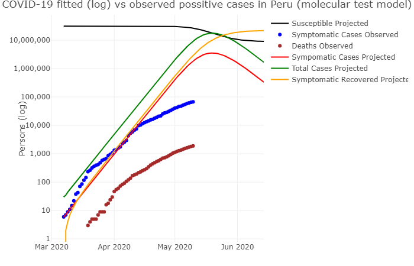
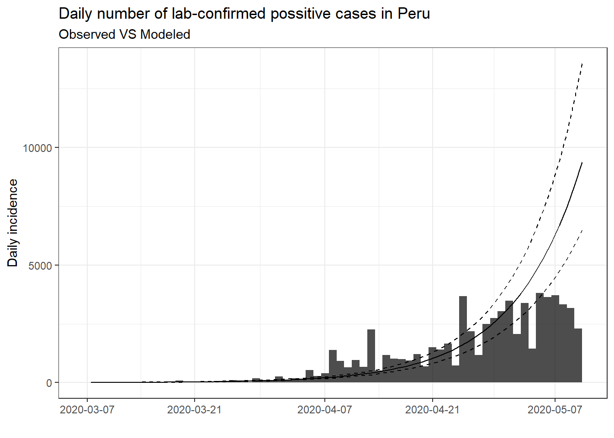

Alexis Roldan

# COVID-19 Outbreak Analytics - Peru

## Disclaimer

I am a data scientist that, motivated by several analysis
currently being performed to understand COVID-19 spread in Peru, decided
to collaborate by creating different models to help understand and forecast infectation
rate across Peru based on molecular test results.

Clearly, I'm no epidemiologist so I will abstain from from providing
infrastructure for analyzing the spread of the disease or estimating the
effects of non-pharmaceutical interventions. Instead this report serves
the purpose to model various Covid-19 related data sources for Peru
with a special focus on non-pharmaceutical interventions.

In that way, I hope that it might be helpful for others that are
interested in doing research on the Covid 19 pandemic by promoting the
benefits of open science.

## The Data

Currently, this report uses different dataset from different packages and official MINSA reports.

## Analysis

